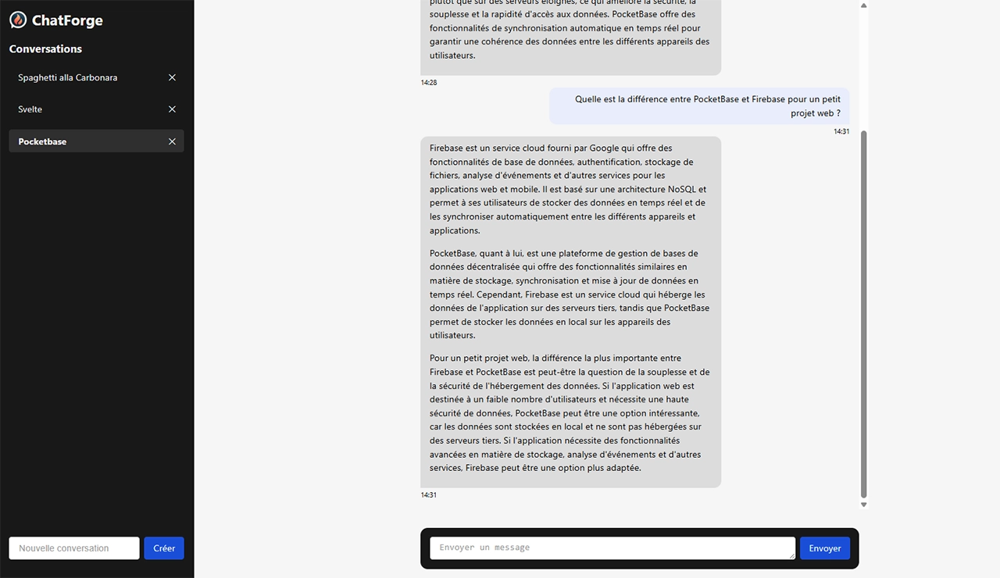
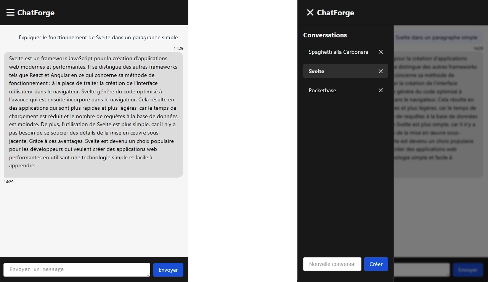

# ChatForge

**ChatForge** est une application front-end développée avec **Svelte**.  
Elle permet de créer une interface de chat où l’utilisateur peut échanger avec une IA via l’API **Mistral**, tout en stockant les conversations localement avec **PocketBase**.

---

## Aperçu

## 

## Fonctionnalités principales

### Gestion des Messages

- Affichage des messages sous forme de discussion (Utilisateur vs IA).
- Envoi d’un message utilisateur et stockage en base de données locale (PocketBase).
- Envoi du message à l’API Mistral et récupération de la réponse de l’IA.
- Affichage de la réponse de l’IA et stockage en base locale.

### Gestion du Token d’Authentification

- Saisie et enregistrement d’un token API dans le **localStorage**.
- Vérification automatique de la présence du token avant l’envoi des requêtes à l’API IA.

### Gestion des Conversations

- Liste des conversations existantes récupérées depuis PocketBase.
- Sélection d’une conversation pour afficher ses messages.
- Création d’une nouvelle conversation avec titre personnalisé.
- Suppression d’une conversation et de tous les messages associés avec mise à jour immédiate de l’interface.

---

## Technologies utilisées

- **Frontend** : Svelte
- **Bibliothèques** : `marked` pour le rendu Markdown des messages
- **Backend** : PocketBase pour le stockage des messages et conversations
- **API IA** : Mistral AI
- **Stockage local** : `localStorage` pour le token API

---

## Architecture de l’application

### Composants principaux

- **Sidebar Conversations** : liste des conversations avec possibilité de sélectionner, créer ou supprimer une conversation.
- **Zone de Chat** : affichage des messages avec distinction visuelle entre utilisateur et IA.
- **Zone de Saisie** : champ texte pour envoyer un message et bouton d’envoi.
- **Gestion des Tokens** : formulaire pour saisir et sauvegarder le token API Mistral.

---

## Échanges avec les API

### API locale (PocketBase)

- **Récupérer toutes les conversations** :  
  `GET /collections/conversations/records`
- **Créer une conversation** :  
  `POST /collections/conversations/records`
- **Supprimer une conversation** :  
  `DELETE /collections/conversations/records/{id}`
- **Récupérer les messages** :  
  `GET /collections/message?sort=created`
- **Envoyer un message** :  
  `POST /collections/message`

### API IA (Mistral AI)

- **Envoyer un message et récupérer la réponse IA** :  
  `POST https://api.mistral.ai/v1/chat/completions`

---

## Base de données (PocketBase)

L’application utilise **PocketBase** pour stocker les **conversations** et les **messages** localement.

### Collections à créer

#### 1️⃣ `conversation`

- **Description** : contient les conversations de l’utilisateur.
- **Champs requis** :

  | Champ     | Type | Description                              |
  | --------- | ---- | ---------------------------------------- |
  | `id`      | auto | Identifiant unique généré par PocketBase |
  | `title`   | text | Nom de la conversation                   |
  | `created` | date | Date de création (auto)                  |
  | `updated` | date | Date de dernière modification (auto)     |

#### 2️⃣ `message`

- **Description** : contient tous les messages échangés dans les conversations.
- **Champs requis** :

  | Champ          | Type                      | Description                                                             |
  | -------------- | ------------------------- | ----------------------------------------------------------------------- |
  | `id`           | auto                      | Identifiant unique                                                      |
  | `role`         | text                      | Rôle du message : `user` ou `assistant`                                 |
  | `content`      | longtext                  | Contenu du message                                                      |
  | `conversation` | relation → `conversation` | Relation vers la conversation à laquelle le message appartient (single) |
  | `created`      | date                      | Date de création (auto)                                                 |
  | `updated`      | date                      | Date de dernière modification (auto)                                    |

> ⚠️ Important : la relation `conversation` dans la collection `message` doit être **single relation**, chaque message appartient à une seule conversation.

---

## Contraintes et spécifications techniques

- Application **responsive** (desktop et mobile).
- Distinction visuelle claire entre messages utilisateur et messages IA via CSS.
- Gestion des erreurs lors des appels API (connexion, réponses invalides, absence de token, etc.).
- Mise à jour dynamique de l’interface lors de la sélection, création ou suppression de conversations.
